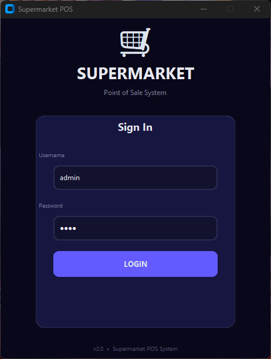
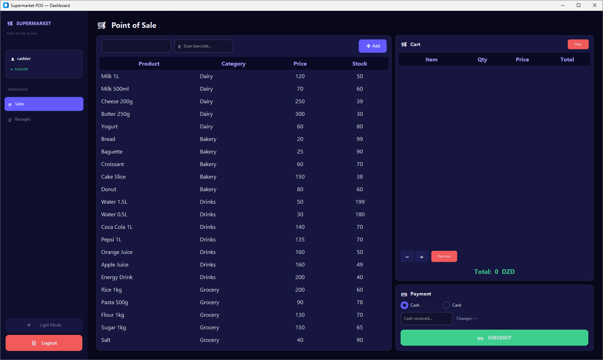
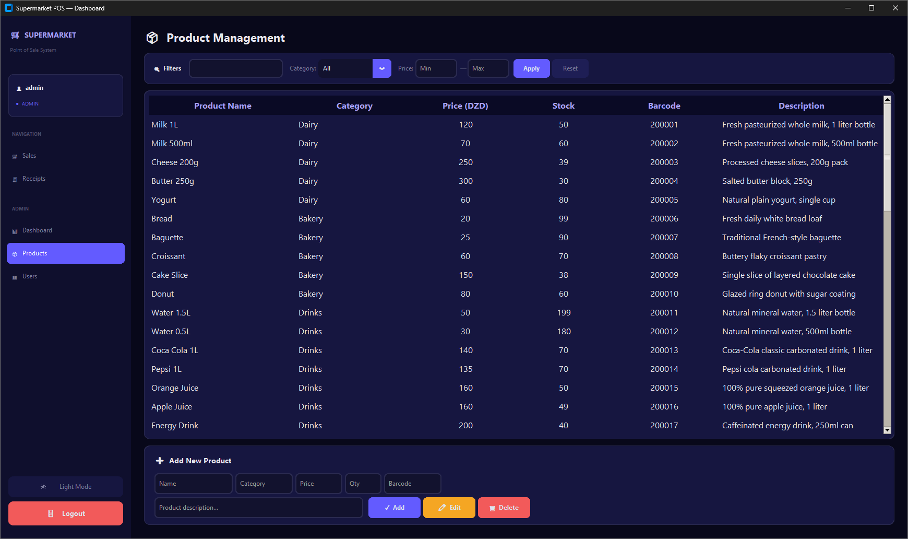
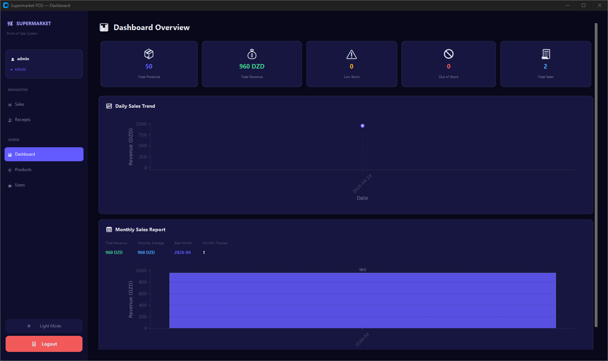
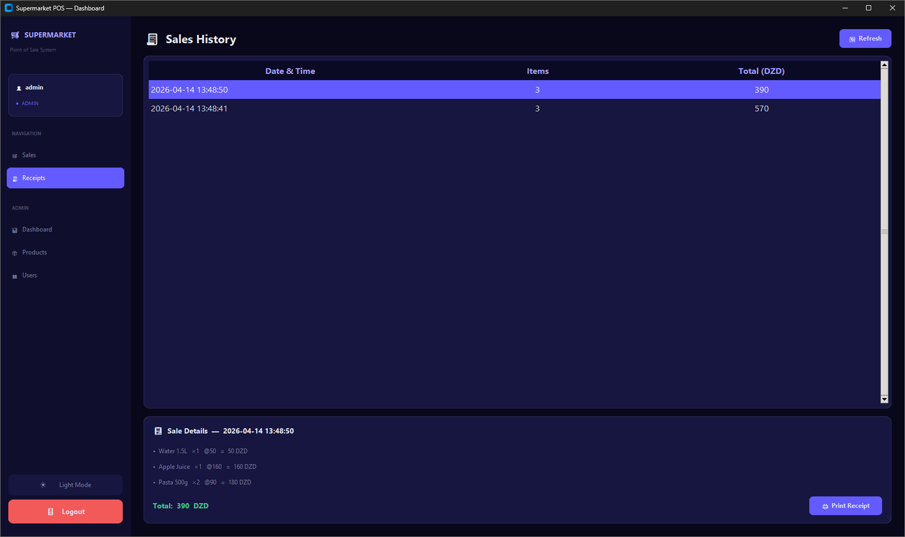
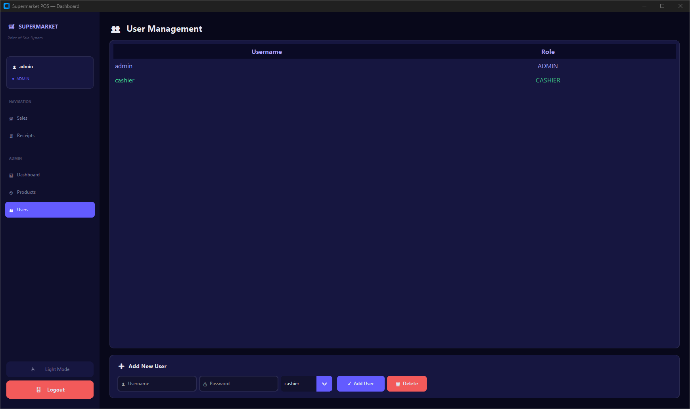

# 🛒 Supermarket POS System

A professional Point of Sale (POS) desktop application built with Python, CustomTkinter, and MongoDB. Designed for supermarket environments with role-based access control, real-time inventory management, and PDF receipt generation.

✨ Features

# 🔐 Authentication & Security
- Secure login system with **bcrypt** password hashing
- Role-based access control (**Admin** / **Cashier**)
- Admin-only management panels

# 🛒 Point of Sale (Cashier & Admin)
- Product search and barcode scanning
- Shopping cart with quantity controls (+/−/remove)
- Stock validation (prevents over-selling)
- Cash & Card payment modes with change calculation
- Automatic PDF receipt/invoice generation

# 📦 Product Management (Admin Only)
- Full CRUD operations (Add, Edit, Delete)
- Advanced filters: category, price range, name search
- Low stock and out-of-stock visual indicators
- Barcode support for each product

# 📊 Dashboard & Analytics (Admin Only)
- Stat cards: Total Products, Revenue, Low Stock, Out of Stock, Total Sales
- Daily sales trend chart (line graph)
- Monthly sales report (bar chart with summary stats)
- Low stock alerts list

# 🧾 Receipts & Sales History
- View all past sales with item details
- Print/reprint PDF receipts from sales history
- Professional PDF invoices saved to `receipts/` folder

# 👥 User Management (Admin Only)
- Create new users (Admin or Cashier roles)
- Delete non-admin users
- User list with role indicators
dashboard interface admin  

# 🎨 UI/UX
- Dark & Light theme toggle
- Professional dark-themed UI with CustomTkinter
- Responsive fullscreen layout (F11 toggle, Esc to exit)
- Styled data tables with color-coded stock indicators

# 📐 Architecture

The project follows the **MVC (Model-View-Controller)** pattern:

┌─────────────┐     ┌──────────────────┐     ┌─────────────────┐
│   Views     │────▶│   Controllers    │────▶│     Models      │
│  (GUI/UI)   │     │ (Business Logic) │     │  (MongoDB ORM)  │
└─────────────┘     └──────────────────┘     └─────────────────┘
                                                      │
                                                      ▼
                                              ┌───────────────┐
                                              │   MongoDB      │
                                              │  (supermarket) │
                                              └───────────────┘

# 🛠 Tech Stack

| Component     | Technology                    |
|---------------|-------------------------------|
| Language      | Python 3.10+                  |
| GUI Framework | CustomTkinter                 |
| Database      | MongoDB (local)               |
| DB Driver     | PyMongo                       |
| Security      | bcrypt                        |
| PDF Reports   | ReportLab                     |
| Charts        | Matplotlib (TkAgg backend)    |
| Packaging     | PyInstaller                   |

# 📁 Project Structure

POS_System/
├── app.py                  # Entry point — launches login window
├── init_db.py              # Database initializer (creates default users)
├── 1.py                    # Product seeder (inserts 50+ sample products)
├── requirements.txt        # Python dependencies
├── POS_System.spec         # PyInstaller build spec
├── README.md               # This file
│
├── config/
│   └── db.py               # MongoDB connection & collection references
│
├── models/
│   ├── product_model.py    # Product CRUD operations
│   ├── sale_model.py       # Sale record operations
│   └── user_model.py       # User CRUD operations
│
├── controllers/
│   ├── auth_controller.py  # Login & registration logic
│   ├── product_controller.py # Product validation & business logic
│   └── sale_controller.py  # Sale processing, reporting & receipts
│
├── views/
│   ├── login_view.py       # Login screen
│   ├── dashboard_view.py   # Main shell with sidebar navigation
│   ├── dashboard_stats.py  # Admin analytics dashboard
│   ├── sales_view.py       # POS / checkout interface
│   ├── product_view.py     # Product management panel
│   ├── user_view.py        # User management panel
│   ├── receipt_view.py     # Sales history & receipt viewer
│   └── theme.py            # Color palettes, fonts & treeview styles
│
├── utils/
│   ├── notifications.py    # Success/error/confirm dialog helpers
│   ├── receipt.py          # PDF receipt generator (ReportLab)
│   └── security.py         # bcrypt hash & check functions
│
└── receipts/               # Generated PDF invoices (auto-created)

📦 The database dump/export is available in the `supermarket` folder.

# 🚀 Installation

# 1. Clone or download the project
cd path/to/POS_System

# 2. Create a virtual environment

python -m venv script
script\Scripts\activate       # Windows
# source script/bin/activate  # macOS/Linux

# 3. Install dependencies

pip install -r requirements.txt

# 4. Initialize the database

python init_db.py

This creates two default users:
- **admin** / `1234` (Admin role)
- **cashier** / `1234` (Cashier role)

# 5. Seed sample products

python product_data.py

This inserts 50+ products across 11 categories (Dairy, Bakery, Drinks, Grocery, Snacks, Meat, Eggs, Cleaning, Personal Care, Canned, Fruits & Vegetables).

#🎮 Usage

# Run the application

python app.py

# Workflow

1. **Login** with your credentials
2. **Sales View** — Scan barcodes or search products, add to cart, checkout
3. **Receipts** — View past sales, reprint PDF receipts
4. **Dashboard** (Admin) — View analytics, charts, low-stock alerts
5. **Products** (Admin) — Add, edit, delete, and filter products
6. **Users** (Admin) — Create/delete user accounts

# Keyboard Shortcuts

| Key     | Action                        |
|---------|-------------------------------|
| Enter   | Submit login / scan barcode   |
| F11     | Toggle fullscreen             |
| Escape  | Exit fullscreen               |

# 🔑 Default Credentials

| Username  | Password | Role    |
|-----------|----------|---------|
| `admin`   | `1234`   | Admin   |
| `cashier` | `1234`   | Cashier |

> ⚠️ Important:
  Run `python init_db.py` first to create these users with properly hashed passwords.

#📦 Building the Executable

To create a standalone `.exe` file:

# Activate virtual environment
script\Scripts\activate

# Build the executable
pyinstaller --onefile --noconsole --name POS_System app.py

# Or using the existing spec file:
pyinstaller POS_System.spec

# 📝 License

This project is developed as an educational mini-project.

<<<<<<< HEAD
  Made with ❤️ using Python & CustomTkinter
=======

Made with ❤️ using Python & CustomTkinter
>>>>>>> a386e60ec186bc8520e2c7eab7cdf59ce16a92d5
